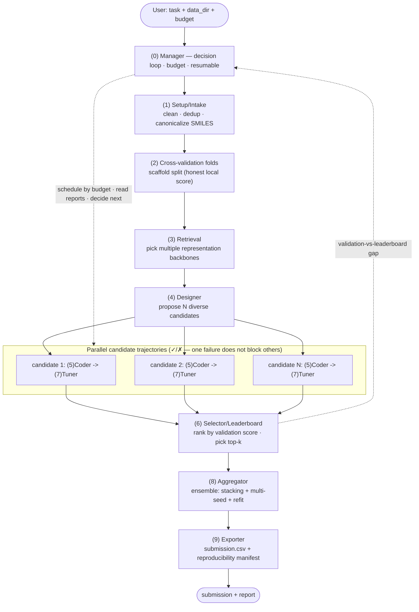

# PRODUCT DESIGN — llm-bio-automl

> Product design for an LLM-orchestrated molecular-property AutoML agent, with one North Star: **finishing Top 5 on openadmet/pxr-challenge**.

> Rendered flowchart: [assets/workflow.png](../assets/workflow.png) (see §9). The Mermaid source below also renders natively on GitHub or in a VS Code Mermaid-preview extension.

---

## 0. Glossary / Legend — read this first

Plain-language meaning of every term and abbreviation used in this document. (The **★** in the flowchart marks the highest-priority steps — the ones with the biggest impact on the final rank.)

### Machine-learning terms
- **Cross-validation (CV)** — our local "practice score". We split the training data into several slices ("folds"), train on some and test on the held-out one, then average. It tells us how good a model is *before* we submit anything.
- **Fold** — one slice of the training data used in cross-validation.
- **Fold-in** — *adding* an extra labelled dataset into the training set to improve the model (e.g. folding Analog Set 1's 253 labels into training; measured to drop single-model analog RAE ~0.10). **Deferred for now** (decision 2026-06-21): Set 1 is used as a validation/diagnostic signal to *adapt* the pipeline, not a training input — fold-in is a later data-side lever. Don't confuse with a CV *fold* (a data slice) above.
- **Analog set / Analog Set 1 & 2** — the 513-compound test set is an *analog set*: close structural analogs (ECFP4-Tanimoto > 0.4) of 63 active hits, with activity cliffs — a *narrower* distribution than the broad training set. Split into **Analog Set 1** (253, now public → our true validation set) and **Analog Set 2** (260, blind, decides the final rank). See CHALLENGE_BRIEF.md.
- **Scaffold split** — a careful way to make those folds so that molecules with the same chemical skeleton don't end up in both training and testing. Stops the model from "cheating" and gives an honest score.
- **Leakage** — when information from the test data accidentally slips into training, making local scores look better than they really are.
- **Out-of-fold prediction (OOF)** — a model's prediction for a data point made *while that point was held out*. These honest predictions are the raw material for ensembling.
- **Ensembling** — combining several models' predictions into one stronger prediction.
- **Stacking** — a kind of ensembling where a second model learns the best way to blend the others' out-of-fold predictions.
- **Multi-seed** — training the same model a few times with different random starting points and averaging, to reduce luck.
- **Featurizer** — code that turns a molecule into numbers a model can read.
- **Fingerprint (Morgan / ECFP)** — one common numeric representation of a molecule (a list of 0/1 bits describing its substructures).
- **Descriptors (RDKit)** — hand-computed molecular properties (weight, polarity, etc.).
- **Chemical language model (CLM)** — a neural network (e.g. ChemBERTa, MolFormer) pretrained on millions of molecules that converts a molecule into a rich numeric vector.
- **Embedding** — that numeric vector representing a molecule.
- **GBDT (gradient-boosted decision trees)** — a strong family of classical models (XGBoost, LightGBM, CatBoost).
- **GNN (graph neural network)** — a model that treats a molecule as a graph of atoms and bonds.
- **Hyperparameter** — a setting you choose before training (e.g. how deep a tree is), as opposed to what the model learns on its own.
- **TTA (test-time augmentation)** — make a few slightly varied versions of each test input and average the predictions.
- **AutoML (automated machine learning)** — software that automates the trial-and-error of model building (choosing features, models, and settings) instead of a human hand-crafting each pipeline.
- **RDKit** — the open-source cheminformatics toolkit we use to parse, clean, and compute properties of molecules from SMILES.
- **Canonicalization (canonical SMILES)** — rewriting each SMILES into one standard form so the same molecule always has identical text (prevents hidden duplicates).
- **Desalting** — stripping salt / counter-ion fragments so only the active molecule is kept.
- **Deduplication (dedup)** — removing repeated molecules so one structure isn't counted twice.
- **Replicate measurements** — multiple lab readings of the same molecule; we aggregate them into a single value before training.
- **Bemis-Murcko scaffold** — a molecule's core skeleton (rings + linkers, side chains removed); the grouping used by the scaffold split.
- **MACCS keys** — a fixed 166-bit fingerprint where each bit flags a specific predefined chemical pattern.
- **Avalon fingerprint** — another bit-vector fingerprint type, an alternative to Morgan / MACCS.
- **Feature fusion (`fusion:[...]`)** — concatenating several featurizers' outputs into one combined representation.
- **Backbone (representation backbone)** — the pretrained model / featurizer that turns a molecule into its numeric representation.
- **Linear models (Ridge / ElasticNet)** — fast regression models that fit a (regularized) weighted sum of the features.
- **Random forest** — a model that averages many decision trees built on random subsets of the data.
- **MLP head (multi-layer perceptron)** — a small neural network put on top of features / embeddings to predict the target.
- **Sample weight** — a per-row importance value (here from each label's standard error) so noisier measurements count less during training.
- **Full-data refit** — retraining the chosen model on 100% of the training data (after CV) before predicting the test set.
- **Sanity check** — a quick small-sample run that confirms a plan executes correctly before the full run.
- **Stratified group split** — a fallback fold split (balances the target while keeping groups intact) used when scaffolds are too fragmented.
- **MPS (Metal Performance Shaders)** — Apple's GPU backend on Macs; lets embedding extraction use the Mac GPU without NVIDIA / CUDA.
- **Forward pass** — running data once through a pretrained network just to read out its output (here, to extract an embedding); no training, so it runs fine on CPU / MPS.
- **Feature scaling (scaler)** — rescaling feature values to a common range (e.g. zero mean / unit variance). A scaler *learns* from data, so it must be fit on the train fold only to avoid leakage.
- **Meta-model** — in stacking, the second model that learns how to best combine the base models' out-of-fold predictions.
- **scikit-learn (sklearn)** — the standard Python ML library; "sklearn-style" means a model that exposes `.fit()` / `.predict()`.

### Task & scoring terms
- **SMILES** — a text string that encodes a molecule's structure (e.g. "CCO" = ethanol).
- **pEC50** — the value we must predict; a number describing how potent a molecule is (higher = more potent).
- **RAE (relative absolute error)** — the competition's score (lower is better).
- **MAE (mean absolute error)** — the average size of prediction errors.
- **R² (R-squared)** — how much of the variation the model explains (higher is better, max 1).
- **Leaderboard (LB)** — the contest ranking. **Public LB** = what you see during the contest; **private LB** = the hidden part that decides the final rank.
- **Standard error (of a measurement)** — how uncertain one pEC50 lab value is (small = precise); used as a sample-weight signal.

### Product / project terms
- **North Star (metric)** — the one number that defines success (here: final rank).
- **PRD (product requirements document)** — this file.
- **ROI (return on investment)** — bang for the buck.
- **KR (key result)** — a measurable target.
- **JTBD (jobs to be done)** — the real job a user is "hiring" the product to do.
- **DAG (directed acyclic graph)** — a fixed one-way sequence of steps with no loops.
- **run_id** — a unique label for one run of the system, so all its output files stay grouped together.
- **Agent** — one component/step of the pipeline. Some use an LLM to decide; some are plain deterministic code.
- **LLM (large language model)** — the AI (e.g. Claude) we use to make some decisions.
- **MCP / SDK** — technical plumbing for connecting tools to an LLM (not important for v1).
- **AIBuildAI** — the reference AutoML agent that ranked #1 on MLE-Bench; our benchmark for what a strong system looks like (see §7).
- **MLE-Bench** — a benchmark that scores AutoML / agent systems on real ML competitions; AIBuildAI topped it.
- **P0 / P1 / P2** — priority tiers for features and personas (P0 = must-have / primary; higher number = lower priority).
- **TUI (text user interface)** — a terminal-based interface (explicitly a v1 non-goal).
- **Definition of Done (DoD) / Acceptance criteria** — the checklist a feature (or the whole product) must meet to count as finished (see §17).
- **PlanSpec / TaskSpec / RunState / FoldSpec** — the system's core data structures (full fields in §11.3): TaskSpec = task & data description; PlanSpec = one modeling recipe (featurizer + model + params + seeds); FoldSpec = the frozen CV fold assignments; RunState = a run's current stage and produced artifacts.

### General design terms
- **Trade-off (tension)** — when two things you both want pull against each other, so improving one tends to worsen the other (e.g. *flexibility* vs. *reliability*); you have to choose a balance instead of getting both fully.
- **Deterministic** — always produces the same output for the same input (no randomness, nothing made up on the fly). The opposite of "the result changes each time".
- **Registry** — a simple catalog of available building blocks (e.g. featurizers and models) that the system can pick from.
- **Sandbox** — a safe, isolated place to run code so that if it misbehaves it can't damage anything else.
- **Escape hatch** — an optional fallback path added for the rare cases the normal path can't handle.
- **Top-k** — the k highest-ranked items kept after sorting (k is a small number we choose).

---

## 1. Document Meta

| Field | Value |
|---|---|
| Product | llm-bio-automl (LLM-orchestrated molecular-property AutoML agent) |
| Version | v1.7 |
| Status | Live (best Set-1 judge RAE **0.5706**, ≈ rank ~20/328) |
| Owner | Kyle (hshunjie@gmail.com) |
| Created | 2026-06-20 |
| North Star | pxr-challenge private LB **Top 5** |

### Changelog

| Version | Date | Change |
|---|---|---|
| v1.0 | 2026-06-20 | First full PRD: "content over orchestration" strategy, 10-node flowchart, data contracts, M0–M3 roadmap |
| v1.1 | 2026-06-20 | Unified approach naming (Approach 1/2/3) and sequenced them to milestones (M1→M4); added M4 escape-hatch milestone; recorded M0 scaffold-CV done; resolved GPU/split open questions; created companion [TECHNICAL_DESIGN.md](TECHNICAL_DESIGN.md) |
| v1.2 | 2026-06-22 | M1 menu **completed** (`molformer`, `mlp_head`, sample weights — judged on Set 1: mlp kept, others dropped); M2.5 **done** (Set-1 judge harness, calibrated cluster folds, final submission 0.6266); M3 automation **built** (judge-in-the-loop LLM **Designer** + **Tuner** + Manager loop, budget/resume/never-regress); M4 codegen **skipped** (ceiling is data, not the menu); §11.1 LLM-component status table added |
| v1.3 | 2026-06-22 | Added **M5 Data side** as the current priority (auxiliary configs → external data via DataMaster arXiv 2605.10906 → end-game Set-1 fold-in); model side confirmed at its ceiling (~0.62) |
| v1.4 | 2026-06-22 | M5(a) done: in-dataset auxiliary pEC50 rows **hurt** the judge (dropped). Read 2 PXR leaderboard solutions (§7.1): leaders win via a **graph foundation model (ChemProp/CheMeleon)** we lack + fine-tuning on `single_concentration`; **external data confirmed a dead end**; Butina CV validated. **Revised priority → integrate ChemProp/CheMeleon** (corrects "ceiling is data, not method") |
| v1.6 | 2026-06-24 | **Deep-research grounding** (3 systems → `research/worth_trying_*.md`) confirmed the winning playbook. **CheMeleon integrated** (frozen embeddings + GPU fine-tune on A5000): ensemble judge **0.6266 → 0.6217 → 0.6135**. Isotonic calibration tried (no help — broad→analog shift). Reframed roadmap as **M6 Research-grounded playbook** (CheMeleon → multitask Chemprop → counter-assay weighting → Mordred → end-game Set-1 fold-in + report). **Corrected target: top-5 is achievable on public data** (most top-5 used no proprietary data); gap = execution depth |
| v1.7 | 2026-06-26 | **New best RAE 0.5706 (≈ rank ~20)** via the **decorrelation thesis**: 2 fine-tuned foundation models from different families — CheMeleon multitask (graph, single 0.5904) + Uni-Mol (3D, single 0.6248, corr 0.866) — ridge-stacked beat the old 48-base correlated ensemble. **LLM-orchestrated fine-tuning added** (`finetune_designer` picks decorrelated backbones+epochs → `finetune_runner` → GPU → stack → judge, reproduces 0.5706). **Architecture B built** (`skill_manager`: an LLM **Manager** reasons over lesson-encoded skills and decides the next step — the "whole pipeline is LLM-driven" form) with **per-stage observability** (`stage_log.jsonl` tags each step llm/fallback/deterministic). **Live model retrieval** (`hf_retrieval`) replaces the static 7-ChemBERTa manifest. **AIBuildAI re-grounded** from its official diagram (6 LLM agents — see `docs/AIBUILDAI.md`). See §0.1 for the current-state summary. |

---

## 0.1 Current state at a glance (2026-06-26) — read this for the "what exists now"

> The detailed sections below were written as the system was *designed*; this box is the **ground truth of what runs today**, so a new reader isn't misled by older milestone text.

- **Result:** best **Set-1 judge RAE 0.5706** (≈ leaderboard rank ~20/328). Progression 0.6329 → 0.6217 → 0.6135 → 0.6108 → 0.5916 → **0.5706**. The frozen-menu pipeline alone caps at **~0.62 (rank ~84)**; the gap to 0.57 is **fine-tuning decorrelated foundation models**.
- **The winning recipe (the "content"):** fine-tune **two decorrelated foundation families** — CheMeleon (graph) + Uni-Mol (3D) — and **ridge-stack** them. Two decorrelated strong models beat many correlated ones. (TTA, counter-assay weighting, Mordred, isotonic, SMILES transformers all tried and **dropped** — see `CLAUDE.md` / `RESULTS.md`.)
- **Two orchestrators exist today** (a known source of confusion):
  1. **`scripts/run_auto.py`** — the original *menu loop*: LLM Designer proposes `featurizer×model` plans → deterministic CV runner executes → select → ridge-stack → Set-1 judge. Now also calls a **fine-tune phase** + live retrieval.
  2. **`scripts/run_skill_manager.py` (Architecture B)** — an LLM **Manager** (`src/agent/skill_manager.py`) that **reads skills whose descriptions encode our lessons and decides the next skill itself** (retrieve / design_menu / finetune / stack), looping until it calls `finish`. This is the "control flow is the LLM's, not a fixed script" form.
- **What is LLM-driven vs deterministic today:** LLM = Designer (`menu_designer`), Fine-tune Designer (`finetune_designer`), Tuner (`menu_tuner`), Manager-B (`skill_manager`). Deterministic = data setup/curation, CV/fine-tune execution, ridge stack, Set-1 judge, selector, live HF retrieval (HTTP). Every LLM step has a **deterministic fallback**, so the loop always completes (logged as `fallback`).
- **Verified vs not (honesty):** the **orchestration** is verified end-to-end on a Mac in **`--collect-only`** mode — it *reuses* pre-computed fine-tune predictions (no GPU) and reproduces 0.5706. A **real** end-to-end run that *trains* the foundation models needs the **DSMLP A5000 GPU** (drop `--collect-only`, ~2h/backbone) and has not yet been run through Architecture B.
- **Reference:** the agent loop targets **AIBuildAI** (#1 MLE-Bench) — 6 LLM-driven agents (Setup/Manager/Designer/Coder/Tuner/Aggregator). Our two remaining gaps to that bar: **parallel candidate chains** and a **code-writing Coder** (ours instantiates verified templates). Full comparison: **[AIBUILDAI.md](AIBUILDAI.md)**.

## 2. Background & Problem Statement

### 2.1 Background
- The repo started as `bio-model-skills-creator`: a skill that scrapes biological foundation models from Kaggle and generates a `SKILL.md` library (see [SKILL.md](SKILL.md)).
- On top of that library we want a *consumer*: an AutoML agent that automatically uses those skills + classical ML to produce a competitive submission for a bio task.
- Today we have "7-agent shells + a deterministic ML layer", but **the designer is stubbed, the coder is locked to 2 model families, the manager is a fixed DAG, and only the tuner actually calls an LLM**.

### 2.2 Problem
The current system effectively does just one thing: **let an LLM pick 5 hyperparameter trials from a tiny grid on top of a fixed baseline**. It cannot explore the modeling content that wins (diverse representations, strong models, ensembling), and it has no leak-proof CV. So "AutoML" is mostly in name, and we're far from Top 5.

### 2.3 Core Insight (drives the whole design)
> **Top 5 comes from modeling content (representation diversity + leak-proof CV + ensembling), not from fancy agent orchestration.** AIBuildAI ranked #1 on MLE-Bench because its Coder can write arbitrary code and its Aggregator truly ensembles — i.e. its agents can *reach* the content that wins. So this product spends **80% of effort on modeling content, 20% on orchestration automation.**

---

## 3. Goals & North Star

### 3.1 North Star
pxr-challenge **private LB → Top 5**.

### 3.2 Product Goals
1. Push RAE on PXR activity well below the current ~0.55 baseline.
2. Let the system automatically explore "multi-representation × multi-model × ensemble".
3. Use scaffold-split CV so the public↔private gap is controlled.
4. Be fully reproducible and resumable.

### 3.3 Key Results (KRs)
| KR | Target |
|---|---|
| **Rank — Top 5 on the final Phase-2 (blind Set-2) board** | This is the goal: a *rank*, **not a fixed RAE**. The interim 0.528–0.538 is a **moving reference, not a target** — in Phase 2 everyone folds Set 1 into training, so the real cutoff **tightens below 0.538**. Drive **Analog-Set-1 RAE as low as we can, clearly under the field** — don't lock a single number. |
| Validation honesty | broad scaffold-CV is NOT a reliable proxy (measured 0.543 scaffold-CV vs **0.633** on real analog labels); judge everything on **Analog Set 1**. |
| ensemble gain vs best single model | ≥ 3% |
| end-to-end reproducibility | 100% (same run_id + seed) |

---

## 4. Non-Goals (Out of Scope)

Explicitly **not** in v1, to keep focus:
- ❌ General multi-task AutoML, a multi-task-markdown abstraction layer
- ❌ Polished TUI / web UI
- ❌ A fully open code-generation sandbox (replaced by an extensible templated execution layer, see §11)
- ❌ Auto-submission to the leaderboard, distributed/multi-node training
- ❌ Structure Track (Activity Track only)

---

## 5. Target Users & Personas

| Persona | Description | Key needs |
|---|---|---|
| **P0: Competitor (you)** | ML/eng-capable, time-constrained, wants rank | Auto-produce strong submissions; trustworthy CV; reproducible & iterable |
| P2: Future bio-ML competitor | Drop in task + data and run | Generality (v2) |

v1 serves P0 only.

---

## 6. User Scenarios & User Stories (JTBD)

- **US-1**: As a competitor, I want "one command from data to submission" so I don't hand-build every pipeline.
- **US-2**: As a competitor, I want the system to **automatically try many representations and models and ensemble them**, so I approach the leaderboard ceiling.
- **US-3**: As a competitor, I want to see the **CV↔LB gap**, so I know whether I'm overfitting and can trust my local score.
- **US-4**: As a competitor, I want **resume after interruption** and reproducible results, so iteration doesn't waste compute.
- **US-5**: As a competitor, I want to set a **time/call budget** so the system wraps up with the current best within budget.

Typical flow:
```
configure (task + data + budget) → one command → watch live leaderboard/run_state
  → (interruptible, resume next time) → get submission.csv → read CV-LB gap report → adjust & rerun
```

---

## 7. Competitive Analysis

**Reference: AIBuildAI (MLE-Bench #1)**

| Dimension | AIBuildAI | Current product | Target |
|---|---|---|---|
| Manager | decision loop (call/finish/stop) + budget | fixed DAG | decision loop + budget |
| Designer | proposes 6 candidate designs | **stubbed, 1 fixed baseline** | proposes N diverse candidates |
| Coder | actually writes config.py+train.py, runs sanity check | runner wrapper locked to 2 families | executes arbitrary candidate pipelines (templated layer) |
| Trajectories | parallel D→C→T (✓/✗) | serial single plan | parallel candidate trajectories |
| Aggregator | ensemble + TTA + full-data refit + inference.py | takes single best | OOF stacking + multi-seed + full refit |
| Substrate | Claude Agent SDK + MCP | single JSON completion + regex parse | keep deterministic exec layer in v1 (more stable/reproducible) |

**Conclusion**: the role decomposition already matches; the gap is **execution depth**. Borrow its "real Coder + real Aggregator + parallel trajectories + budget", but keep our "LLM proposes / deterministic layer executes" split (more stable and reproducible for a single competition).

### 7.1 Reference solutions on the PXR challenge — why the leaders beat us (read 2026-06-22)

Two published Activity-Track write-ups for *this* challenge, read directly:

| Solution | RAE | Core approach |
|---|---|---|
| [discoverybytes](https://github.com/discoverybytes/openadmet-pxr-blind-challenge/tree/main/activity-prediction) | **0.538** (≈Top-5) | **ChemProp + CheMeleon** (pretrained graph MPNN), **multi-task on 4 assays**, MAE loss — **71% of the ensemble weight** + Uni-Mol (3D transformer, 16%) + MolE→LightGBM (21%), Ridge-stacked. Sample-weight 0.3–0.5 for high-uncertainty; removed 754 reactive electrophiles; **folded in the unblinded test**. |
| [aetherark](https://aetherark.com/openadmet-pxr_phase1.html) | 0.566 (#14/338) | **ChemProp/CheMeleon fine-tuned on the 10,870 single-concentration molecules** (PXR-specific foundation model, continuous+binary); 4-tier NNLS stack; **5-fold Butina OOF**; analog perturbations + GNINA docking in UniMol2. No phase-1 fold-in. |

**Root cause of our gap (our broad ensemble ~0.62 vs their ~0.54):**
1. **Graph foundation model.** Both center on **ChemProp/CheMeleon** (a pretrained molecular message-passing GNN). We have fingerprints + 1D-SMILES transformers (ChemBERTa/MolFormer) and **no graph model** — the GNN we deferred as "heavy." In the 0.538 solution the graph head carries **71%** of the weight. **This is the single biggest lever we're missing.**
2. **They use the `single_concentration` 10,870 molecules** — via **fine-tuning / multi-task a graph model** (not as appended pEC50 rows, which our M5(a) showed hurts). Extra in-domain signal, used the right way.
3. 3D representations (Uni-Mol, GNINA docking) — secondary contributors.

**What they CONFIRM we already got right:**
- **Butina cluster CV** — both leaders use it; matches our calibrated cluster folds (`folds_calibrated.json`). ✅
- **External data hurts** — aetherark: "ChEMBL/BindingDB only hurt"; matches our M5(a) negative result → **skip DataMaster / external data.**
- **Sample weighting** for high-uncertainty labels — both use it (we built the lever).

**Revised strategic read (corrects the earlier "ceiling is data, not method"):** the binding lever is a **graph foundation model (method) trained with the screening data (data) — together.** Our menu (no graph) *did* cap us. **CheMeleon is now integrated** (frozen embeddings + GPU fine-tune): ensemble judge RAE **0.6266 → 0.6217 → 0.6135**. This — not external data, not codegen (M4) — is the documented path. **Strategy going forward: adopt the documented competitor playbook (M6), each technique judged on Set 1.** **Top-5 is genuinely achievable on public data** — per the interim board (§8) most top-5 entries used **no proprietary data** (#1 AIDD-LiLab, #3 nova, #4 N283T, #5 sia all "No"). The gap to the lead pack is **execution depth** (full multitask Chemprop + counter-assay + cluster CV + honest calibration + Phase-2 fold-in), not data access.

---

## 8. Product Principles

1. **Leaderboard impact first** — every feature must answer "does this raise the rank?"
2. **LLM proposes, deterministic layer verifies** — LLM picks plans/params; training & eval always run reproducible code.
3. **Never leak** — scaffold split; featurizers fit on the train fold only; feature cache keyed per fold.
4. **Everything under run_id** — files are the interface; all artifacts land in `outputs/<run_id>/`.
5. **Fail isolated, not global** — a single candidate failure is marked ✗ and never blocks other candidates or the overall result.
6. **Budget-aware** — every stage respects the time/call budget and wraps up with the current best when exceeded.
7. **The judge can't compete** (decision 2026-06-21) — Analog Set 1 (253 now-public labels) is our private validation **judge**: it stays **OUT of training** (no fold-in) and is used to *adapt/select* the pipeline, not as raw train or one-shot test data. We stay in a **Phase-1 setup** (train on broad 4,139, predict 513); fold-in and external/auxiliary data are deferred to a later data-side phase.

---

## 9. Product Flowchart (System Pipeline) ⭐

### 9.1 Diagram

Rendered image: **[assets/workflow.png](../assets/workflow.png)**. Mermaid source (renders on GitHub / VS Code Mermaid preview):

> Note: this diagram is the **abstract node structure** (product-level). It predates the fine-tuning phase and Architecture B, so for *what each node is driven by today* (LLM vs deterministic) and the fine-tune/stack reality, read **§0.1 Current state** and **TECH T1.2**. The parallel candidate chains shown here are the AIBuildAI target we have **not** yet built (see [AIBUILDAI.md](AIBUILDAI.md)).



### 9.2 Each node: what it does / problem solved / input→output / failure handling

| Node | What it does | Problem solved | Input → Output | Failure / edge handling |
|---|---|---|---|---|
| **(0) Manager** | Orchestration decision loop; schedules under budget; reads reports to decide next / stop early / resume | Fixed DAG can't trade off under budget or recover | global context + reports → action + `run_state.json` | agent fails → retry/skip/degrade; budget exhausted → wrap up with current best |
| **(1) Setup/Intake** | Load & validate data; canonicalize SMILES (RDKit), desalt, dedup, aggregate replicate measurements; write task spec | Dirty/duplicate/non-canonical SMILES → noise + leakage | `data_dir`+task → clean train/test + `task_spec.json` + `dataset_report.json` | missing cols / nulls / unreadable → fail fast |
| **(2) CV folds** ⭐ | Bemis-Murcko scaffold split; fixed seed; frozen folds shared by all candidates | Random splits overestimate generalization → private LB collapses; inconsistent folds break fair comparison + stacking | clean train → `folds.json` | scaffolds too fragmented → fall back to stratified group split |
| **(3) Retrieval** | Pick multiple candidate representation backbones + the available featurizer set | Don't know which representations to use; exposing all adds noise | task_spec + registry → `retrieval_result.json` | no match → fall back to a generic chemistry representation set |
| **(4) Designer** | LLM proposes N diverse PlanSpecs (diversity enforced, with validation strategy/risks) | Designer is stubbed today; a single plan caps the ceiling | task_spec+retrieval → `design_plans.json` | LLM fails → fall back to a preset plan template set |
| **(5) Coder** (parallel) | Per plan: sanity check first (small-sample fast run), then featurize → train on frozen folds → produce OOF + test preds + metrics | Locked to 2 families can't reach strong plans; no OOF means no stacking | 1 plan + clean data + folds → `plans/<id>/{metrics,oof,test}` | sanity fails → mark ✗, don't block others |
| **(6) Selector** | Deterministic rank by scaffold-CV primary metric; pick top-k | Using an LLM to "pick the already-top-ranked" is pure waste | all metrics → `leaderboard.json` + top-k | no results → fail |
| **(7) Tuner** (budgeted) | Reuse existing diagnostics (saturation/stagnation detection), search a larger space on top candidates | Default hyperparams aren't optimal; blind grid wastes budget | top candidate + trial history → tuned results + round summary | over budget → stop; LLM fails → fall back to deterministic grid |
| **(8) Aggregator** ⭐ | Cross-representation/cross-model OOF stacking/weighted blend + multi-seed + full-data refit | A single model rarely cracks Top 5; ensembling is the score lever | top-k OOF+test → ensemble preds + `ensemble_report.json` | ensemble not better than best single → fall back to best-single |
| **(9) Exporter** | Validate cols/row count/nulls → emit submission + final_report + reproducibility manifest | Wrong format = disqualified; non-reproducible = can't iterate | final preds + test meta → `submission.csv` + `final_report.json` | validation fails → fail with a clear error |

---

## 10. Functional Requirements (P0/P1/P2)

| Priority | Feature | Node | Approach (§11.2) | Acceptance |
|---|---|---|---|---|
| **P0** | scaffold-CV folds + frozen folds | (2) | M0 foundation → enables Approach 1 | all candidates share one fold set, reproducible |
| **P0** | SMILES canonicalize/desalt/dedup/aggregate replicates | (1) | M0 foundation → enables Approach 1 | dataset_report records before/after diffs |
| **P0** | Coder unlocked: run arbitrary (featurizer, model, params) | (5) | Approach 1 (M1) | ≥4 featurizers × ≥3 models runnable |
| **P0** | OOF predictions | (5) | Approach 1 (M1) | each candidate emits oof_predictions.csv |
| **P0** | Aggregator ensemble/stacking | (8) | Approach 1 (M2) | ensemble CV beats best single by ≥3% |
| **P1** | Real Designer, N diverse candidates | (4) | Approach 1 + orchestration (M3) | LLM yields ≥5 diverse plans, with fallback |
| **P1** | Parallel candidate trajectories (✓/✗) | (5)(7) | Approach 1 + orchestration (M3) | single failure doesn't block overall |
| **P1** | Selector downgraded to deterministic rank | (6) | Approach 1 (M1) | remove the worthless LLM call |
| **P1** | Tuner: larger space + time budget | (7) | Approach 1 + orchestration (M3) | respects budget, stops on timeout |
| **P2** | Manager decision loop + resume | (0) | Approach 1 + orchestration (M3) | interruptible & resumable |
| **P2** | Reproducibility manifest + CV-LB gap report | (9) | Approach 1 (M2/M3) | records seed/versions/plan/gap |

> Note: **every functional requirement here lives inside Approach 1** (its M0 foundation, M1–M2 core, or M3 orchestration). Approach 2/3 (LLM-codegen) is **M4, optional**, and deliberately has no P0/P1/P2 requirement yet — it is added only if evidence shows the menu caps the score.

---

## 11. System Architecture & Data Model

### 11.1 Layers

Top to bottom: the LLM-driven layer proposes, the deterministic layer executes, and both draw on the skill library.

| Layer | Where | Role |
|---|---|---|
| **Agent orchestration** | `src/agent/*` | **LLM proposes** — designer / tuner / manager |
| **Deterministic execution** | `src/*` | **Does the work** — featurizer / CV / trainer / metrics / ensemble |
| **Skill library** | `skills/` | Pretrained representation backbones (`SKILL.md` + manifest) |

**Key constraint**: the LLM only ever outputs "plans / params / decisions"; all training & eval run through the deterministic layer (reproducible, no LLM hallucination contaminating results).

#### LLM-component status (current — what is actually LLM-driven & wired in)

| Component | LLM? | Wired into the live pipeline? | Notes |
|---|---|---|---|
| **Designer** (`src/agent/menu_designer.py`) | ✅ LLM | ✅ **live** in `scripts/run_auto.py` + arch B | proposes `featurizer×model` candidates from the registries; deterministic fallback |
| **Fine-tune Designer** (`src/agent/finetune_designer.py`) | ✅ LLM | ✅ **live** in `run_auto.py --finetune` + arch B | **picks which foundation backbones to fine-tune (decorrelated) + epochs**; validated fallback = `{chemeleon e50, unimol e15}`. This is the lever that reaches 0.5706 |
| **Tuner** (`src/agent/menu_tuner.py`) | ✅ LLM | ✅ **live** in `run_auto.py --tune-top` | proposes hyperparameters for the top bases; deterministic fallback. All optimize the **Set-1 judge** |
| **Manager (Architecture B)** (`src/agent/skill_manager.py`) | ✅ **LLM decision loop** | ✅ **live** in `run_skill_manager.py` | reads lesson-encoded skills + state → **decides the next skill** (retrieve/design_menu/finetune/stack) until `finish`. Logs each step's source (llm/fallback/deterministic) to `stage_log.jsonl` |
| **Manager (menu loop)** (`run_auto.py`) | control flow | ✅ live | the original loop: drives Designer/Tuner + fine-tune phase, budget, resume, never-regress (loop logic itself deterministic) |
| **Selector** (`src/selector.py`) | ❌ deterministic **by design** | ✅ live | the old LLM selector was pure waste (it "picked the already-top-ranked") — PRD §10 downgraded it to a deterministic rank |
| **Live retrieval** (`src/agent/hf_retrieval.py`) | ❌ deterministic (HTTP) | ✅ **live** (`discover_models` → `candidates_live.json`) | live HuggingFace + curated-frontier search, family-classified; **replaces the static 7-ChemBERTa manifest**. (Selection of WHAT to use is the LLM Designer's job.) |
| Legacy `retrieval_agent.py` / `designer_agent.py` / `manager_agent.py` / `tuner_agent.py` | mixed | ❌ superseded | tied to the old `PlanSpec`/runner; replaced by the clean `MenuPlan`-based modules + arch B above |

So today **four** LLM-driven components run (Designer, Fine-tune Designer, Tuner, Manager-B); the Selector is deterministic by design; retrieval is live but deterministic (HTTP); the legacy `*_agent.py` shells are superseded. **Architecture B** (`skill_manager`) is the closest we have to AIBuildAI's LLM Manager — it decides the control flow itself rather than following a fixed script (see [AIBUILDAI.md](AIBUILDAI.md)).

**LLM provider & credit-free operation.** The Designer/Tuner call **OpenRouter** (key/model in `.env`; default model `openrouter/free`), via `src/agent/LLM_base.py`. This is *not* the Claude Code session — it's a separate HTTP API. **A working key/credits are NOT required to run the pipeline:** if the API fails (observed 2026-06-22: `401 "User not found"`) or is unset, the Designer/Tuner **automatically fall back to their deterministic proposers** and the loop completes normally (verified live). Run `scripts/run_auto.py --no-llm` to skip the API entirely. So M3 is functional with or without LLM credits — the LLM only adds proposal *variety*, not a hard dependency.

### 11.2 Execution layer: how the Coder turns a plan into a model — the three approaches

There is a real **trade-off (tension)** between *flexibility* (the system can build anything) and *reliability* (it never breaks and always gives the same result). There are three ways to resolve it, and we sequence them deliberately — **first / next / last**:

| Approach | What the Coder does (the "content") | Strength | Weakness | When we build it |
|---|---|---|---|---|
| **Approach 1 — Rich menu** (deterministic Coder; previously called "Design B") | The Designer (LLM, still dynamic) picks and **combines from a menu** of pre-built, tested building blocks; the Coder **assembles** them with plain code. The dynamism is in the *choices*, not in code generation. | reliable, reproducible, fast, CPU-friendly | bounded by what's in the menu | **FIRST — milestones M1–M2** |
| **Approach 2 — LLM writes code** (codegen Coder; previously "Design A", AIBuildAI style) | The Coder is itself an LLM that writes fresh Python for whatever the Designer invents, runs it in a sandbox, debugs, retries. | unbounded — can invent novel methods | fragile; needs a sandbox + debug loop; slow, costly, hard to reproduce | **LAST — milestone M4, optional** |
| **Approach 3 — Hybrid** | Approach 1 by default **plus** Approach 2 as an "escape hatch" only for novel ideas the menu can't express. | best of both worlds | extra engineering; build only if needed | **end state — M4 onward, only if the menu is the bottleneck** |

> Note: "deterministic Coder" does NOT mean a static pipeline. In Approach 1 the Designer still composes novel combinations every run; only the building blocks are fixed, tested code.

**Sequencing decision (2026-06-20):**
- **First → Approach 1.** Build a rich menu, get honest cross-validation scores, and ensemble (M1–M2). This alone is designed to reach the Top-5 range.
- **Next → extend Approach 1 with automation** (M3): real Designer (multi-candidate), parallel candidates, Manager decision loop, budgets, resume.
- **Last → Approach 2, optional** (M4): add a sandboxed LLM-codegen "escape hatch", turning the system into Approach 3 (Hybrid) — **only if** we find the menu is what caps our score. Added with evidence, not speculation. Approach 1 and Approach 3 start identically, so committing to this plan costs nothing now.

Rationale: for this competition, winning = combining and tuning *known* building blocks + ensembling, so a rich menu reaches the Top-5 range without code generation; reliability and reproducibility directly serve the goal.

**Implementation of Approach 1 — plugin registries (menu COMPLETE as of 2026-06-21, each module judged on Analog Set 1):**
- **Featurizer Registry** — ✅ `morgan` · `maccs` · `avalon` · `rdkit_descriptors` · `chemberta_embedding` (77M + 100M) · **`molformer_embedding`** · `fusion`. (graph/GNN still deferred — heavy.)
- **Model Registry** — ✅ `ridge` · `elastic_net` · `random_forest` · `xgboost` · `lightgbm` · `catboost` · **`mlp_head`**.
- **Training-signal** — ✅ **sample weights from `pEC50_std.error`** threaded through `cv_runner` + `models.fit_model` (`weight_scheme` = none/inv_se/inv_var).
- > **Judge verdicts (keep only what lowers Set-1 RAE — see RESULTS.md §4):** `mlp_head` **kept** (ensemble 0.636→0.632, diversity); `molformer_embedding` **dropped** (single-model RAE ≈ 1.0 on analogs; slightly hurts the ensemble); **sample weights dropped** (raise judge RAE — scaffold-CV's preference for them was another mirage). All three stay in the registries as available levers. Menu now frozen pending the data-side sweep.
- The Coder maps a PlanSpec to `(featurizer_fn, model_cls, params)` and trains on the frozen folds.
- Adding a representation/model = register one function; the Coder doesn't change. **Keeping this menu rich is what makes Approach 1 competitive** (the old code's real problem was a 2-item menu, not the lack of an LLM coder).

### 11.3 Data model (schemas)

| Schema | Fields |
|---|---|
| **TaskSpec** | `challenge_name`, `task_title`, `task_description`, `target_column`, `primary_metric`, `submission_columns`, `data_dir` |
| **PlanSpec** | `plan_id`, `name`, `featurizer`, `model`, `params`, `skill_ref?`, `skill_path?`, `seeds: [int]`, `notes` |
| **RunState** | `run_id`, `current_stage`, `task_spec_path`, `plan_paths`, `result_paths`, `best_plan_path`, `budget_used` |
| **FoldSpec** *(new)* | `strategy` (`"scaffold"`), `n_folds`, `seed`, `assignments` (row_idx → fold) |

*(`?` marks an optional field.)*

> vs current [schemas.py](src/schemas.py): unify `feature_type` / `model_type` → `featurizer` / `model`; add `seeds`, `FoldSpec`, `RunState.budget_used`.

---

## 12. Data Contracts / Interfaces (files as the interface)

Every stage writes into `outputs/<run_id>/`; the next stage reads it directly.

| Artifact | Writer | Reader | Content |
|---|---|---|---|
| `task_spec.json` | Setup | all | TaskSpec |
| `dataset_report.json` | Setup | — | row counts/dedup/validation before & after cleaning |
| `folds.json` | CV | Coder/Tuner/Aggregator | FoldSpec (row→fold) |
| `retrieval_result.json` | Retrieval | Designer | top-k backbones + rationale |
| `design_plans.json` | Designer | Coder | list of PlanSpec |
| `plans/<id>/metrics.json` | Coder/Tuner | Selector/Aggregator | see below |
| `plans/<id>/oof_predictions.csv` | Coder/Tuner | Aggregator | row_id, y_true, y_pred |
| `plans/<id>/test_predictions.csv` | Coder/Tuner | Aggregator/Exporter | id, pred |
| `leaderboard.json` | Selector | Aggregator | ranked candidates |
| `best_plan.json` | Selector | Exporter | current best |
| `ensemble_report.json` | Aggregator | Exporter | weights/members/ensemble CV |
| `cv_lb_gap.json` | Manager | — | local CV vs LB |
| `submission.csv` / `final_report.json` | Exporter | user | submission + reproducibility manifest |
| `run_state.json` / `llm_logs/*.json` | all | user/debug | state + LLM call logs |

**metrics.json contract**:
```json
{
  "plan_id": "...", "featurizer": "...", "model": "...", "params": {...},
  "cv": {"rae": {"mean": 0.49, "std": 0.02, "per_fold": [...]},
         "mae": {...}, "r2": {...}},
  "oof_path": "...", "test_path": "...",
  "runtime_sec": 0, "status": "ok|failed", "error": null
}
```

---

## 13. Non-Functional Requirements

| Dimension | Constraint |
|---|---|
| Reproducibility | same run_id+seed must reproduce exactly; record package versions in the manifest |
| Time budget | `--run-budget-minutes` configurable; wrap up with current best on timeout |
| Call budget | `--max-agent-calls` caps LLM calls |
| No leakage | featurizers fit on train fold only; feature cache keyed per fold |
| Latency | candidates run in parallel; one failure doesn't block the rest |
| Cost observability | log token/cost estimate per LLM call |
| Compute | CPU-runnable by default (fingerprint/descriptor + GBDT); GPU optional (CLM embeddings) |

---

## 14. Metrics & Instrumentation

### 14.1 Core dashboard
- **Set 1 = in-distribution validation/diagnostic signal to ADAPT the pipeline to the real analog prediction** (decision 2026-06-21) — NOT folded into training, and NOT just a passive one-shot test. Use the 253 labels to: (1) **calibrate our internal validation** so it actually predicts analog RAE (scaffold-CV said 0.543; reality 0.633 — miscalibrated); (2) **select models / representations / params by analog performance**; (3) **diagnose & correct failure modes** (activity cliffs, prediction bias — analog y mean 4.66 vs train 4.32). Keep training on broad (4,139); fold-in + external data deferred to the later data-side phase. → `analog_report.json`.
- **Ensemble gain** = ensemble CV − best single-model CV (target ≥ 3%) → `ensemble_report.json`

### 14.2 What to log
- Per candidate: fold-level metrics, OOF, featurizer/model/params, runtime, status (✓/✗)
- Global: leaderboard evolution, LLM call count/cost, per-stage duration, budget consumed
- Reuse existing `llm_logs/*.json` + `run_state.json`; add `cv_lb_gap.json`, `ensemble_report.json`

---

## 15. Milestones & Roadmap (ordered by leaderboard ROI)

Each milestone names the **approach** it advances (see §11.2). Hard ordering: **Approach 1 first** (M1–M2), then automation (M3), then **Approach 2 last and only if needed** (M4). Technical, file-level tasks for each milestone live in the companion **[TECHNICAL_DESIGN.md](TECHNICAL_DESIGN.md)**.

> **Status update (2026-06-26):** M1–M3 done, M4 skipped, M6 done. The earlier "model side at its ceiling ~0.62" was the *frozen-menu* ceiling; **fine-tuning decorrelated foundation models broke it → RAE 0.5706 (≈ rank ~20)** in **M7**. The method lever (graph + 3D foundations, fine-tuned, stacked) — not external data — was the path. Remaining: wire fine-tuning natively + finish **Architecture B** (LLM Manager owns the loop), then the **methodology report (July 1)** and end-game fold-in.

| Milestone | Approach | Content | Exit criteria | Status |
|---|---|---|---|---|
| **M0 Foundation** | prerequisite | unify LLM config; scaffold cross-validation folds; data report | folds verified (0 scaffold leakage); config unified | scaffold CV ✅ done; config pending |
| **M1 Modeling menu** (core) | **Approach 1** | Featurizer + Model registries; CV training loop; OOF + test preds + metrics per candidate | ≥4 reps × ≥3 models; each emits OOF | ✅ built (7 reps × 6 models + stacking); **completing menu → `molformer_embedding`, `mlp_head`, sample weights** |
| **M2 Ensemble** | Approach 1 | Aggregator: OOF stacking + multi-seed + full-data refit | ensemble beats best single by ≥3% | ✅ done (ridge-stack +5.8%) |
| **M2.5 Analog adaptation** | Approach 1 | **Set 1 = validation/diagnostic signal to ADAPT the pipeline to the real analog prediction** — not folded into training, not a passive test. Calibrate the internal validation against it, select & diagnose on it; keep broad training; finish the Approach-1 menu. Target = **Top-5 rank** on blind Set-2. Fold-in + external data deferred. | internal CV calibrated to analog reality; menu completed; analog RAE driven down | ✅ **done** — Set-1 judge harness (`src/analog_judge.py`); menu completed & judged (mlp kept, molformer/weights dropped); CV calibrated to cluster folds (`folds_calibrated.json`); final submission **judge RAE 0.6266** (`outputs/final/`) |
| **M3 Automation** | Approach 1 + LLM orchestration | real Designer + Tuner (judge-in-the-loop), Manager decision loop, budgets, resume | one command auto-produces the best within budget; resumable | ✅ **built & working** — LLM **Designer** (`menu_designer.py`) + LLM **Tuner** (`menu_tuner.py`) + Manager (`scripts/run_auto.py`: propose→run→judge→stack, `--tune-top`, budget/resume, never-regress). Both have deterministic fallbacks. Auto-loop lowers 0.6266→**0.618–0.626**; LLM fallback demonstrated live. Selector deterministic by design; retrieval dormant. Candidates serial w/ ✓/✗ isolation. |
| **M4 Escape hatch** (optional) | **Approach 2 → Approach 3** | sandboxed LLM-codegen `custom_code` plan type with a sanity check | built only if the menu is shown to cap the score | ❌ **not needed / skip** — the trigger never fired: the menu sweep AND the M3 auto-loop both plateau at ~0.62, so the ceiling is the **data** (broad vs analog), not the method menu. Codegen's cost (sandbox, debug loop, non-reproducibility) isn't justified. Revisit only if the data side stalls and a novel method (e.g. activity-cliff Δ-model) is required. |
| **M5 Data side** | **data, not method** | in-dataset auxiliary configs; external data; end-game Set-1 fold-in | each source lowers Set-1 judge RAE | ⚠️ **mostly negative** — auxiliary pEC50 rows **hurt** (M5a); external data a known dead end (our result + competitors). Only the **end-game Set-1 fold-in** survives, deferred to M6 收官. |
| **M6 Research-grounded playbook** | **deep research → grounded implementation** | Read the documented top solutions (via deep research, see §7.1 + `research/worth_trying_MERGED.md`) and adopt their winning techniques, each judged on Set 1: **CheMeleon graph model (frozen + fine-tuned)** → **multitask Chemprop** (primary + counter-assay + targeted PXR external) → **counter-assay weighting** → **Mordred/FCFP4-count** features → honest calibration. | each adopted technique lowers (or is dropped on) the Set-1 judge | ✅ **done** — CheMeleon multitask fine-tune (single **0.5904**, multitask + MAE loss + reactive-electrophile exclusion); 0.6266→**0.6135** along the way; isotonic/Mordred/weights/SMILES-transformers all tried & **dropped** |
| **M7 Decorrelated foundations + Architecture B** (current) | **Approach 1 + LLM orchestration** | (a) **Decorrelation stack** — fine-tune a 2nd, *decorrelated* family (Uni-Mol 3D, single 0.6248, corr 0.866 with CheMeleon) and ridge-stack → break the menu ceiling. (b) **LLM-orchestrated fine-tuning** — `finetune_designer` (LLM picks decorrelated backbones+epochs) → `finetune_runner` (plan→GPU→collect) → stack → judge. (c) **Architecture B** — an LLM **Manager** (`skill_manager`) reasons over lesson-encoded skills and owns the control flow. (d) **Live retrieval** (`hf_retrieval`). **End-game:** Set-1 fold-in + mandatory method report (July 1). | RAE clearly under the field; the loop is LLM-driven & observable; report by July 1 | ⏳ **current** — **RAE 0.5706 (≈ rank ~20)** reached & backed up (tag `v1-working`). LLM-orchestrated fine-tuning **done** (reproduces 0.5706). Architecture B **built & working** (LLM Manager → finetune→stack→0.5706; per-stage `stage_log.jsonl`). Remaining: parallel candidate chains + code-writing Coder (the AIBuildAI gaps, see [AIBUILDAI.md](AIBUILDAI.md)); report; end-game fold-in |

> Hard ordering rule: M0→M1→M2 first (can we reach the top?), then M3 (how hands-off), then M4 (only if the menu is the bottleneck). **Don't spend time on the agent loop or codegen first.**

---

## 16. Risks / Assumptions / Dependencies / Open Questions

### Risks
| Risk | Impact | Mitigation |
|---|---|---|
| Wrong CV (non-scaffold) | public good, private collapses | M0 prioritizes scaffold split + gap monitor |
| Over-investing in orchestration | time not spent on representation/ensemble | roadmap rule M0–M2 first |
| CLM embeddings need GPU | not enough compute | CPU path (fingerprint+GBDT) as fallback |
| Unstable LLM output | designer/tuner crash | every LLM step has a deterministic fallback |

### Assumptions & verified data facts (checked 2026-06-20)
- Task: predict `pEC50` (regression) from a `SMILES` text string; submission columns `SMILES, Molecule Name, pEC50`.
- train = 4,139 rows, test = 513 rows; **all SMILES parse; 0 duplicate molecules; 0 train/test overlap.** So cleaning reduces to canonicalization (no dedup/repair needed).
- Each `pEC50` carries a measurement standard error (0.003–0.74) — a usable sample-weight signal for M1/M2.
- 3,705 distinct scaffolds among 4,139 molecules (chemically diverse).

### Dependencies
- Installed: RDKit, scikit-learn, XGBoost, PyTorch + Transformers (for ChemBERTa).
- To add: LightGBM, CatBoost (via `uv add`).
- LLM: OpenRouter or Anthropic (config to be unified, see M0).

### Open Questions (status as of 2026-06-20)
1. **How does the private LB split the data?** — *Unknown; using the safe default.* The training `Split` column is uniformly "Train", so the organizers gave no usable split → we build our own scaffold cross-validation (the conservative, honest choice regardless of how the LB actually splits).
2. **Are external data / pretrained multi-task models allowed?** — *To confirm.* Decides the representation ceiling.
3. **Is a GPU available?** — *Resolved: no (Mac, no NVIDIA GPU).* We still keep ChemBERTa embeddings — extraction (not training) runs on CPU/MPS and is cached once; the project's best prior result used exactly this.
4. **Competition deadline?** — *To confirm.* Decides how much to compress the roadmap.

---

## 17. Acceptance Criteria / Definition of Done

The product is "done" iff:
1. ✅ One command runs end-to-end and emits a valid `submission.csv`
2. ✅ CV(scaffold) ↔ public LB gap < 0.03
3. ✅ Ensemble CV beats any single model by ≥ 3%
4. ✅ Any candidate failure doesn't affect the overall result; resumable
5. ✅ Same run_id+seed reproduces exactly
6. 🎯 Ultimate: Top 5 on the private LB

---

## 18. Appendix

All terms and abbreviations are defined in plain language in the **Glossary / Legend at the top of this document (§0)**.

### Appendix: related files
- Current data model: [schemas.py](src/schemas.py)
- Orchestration: [manager_agent.py](src/agent/manager_agent.py)
- Execution layer: [runner.py](src/runner.py), [tuner.py](src/tuner.py), [selector.py](src/selector.py), [exporter.py](src/exporter.py)
- Original design notes: [plan.md](plan.md), [plan_mvp.md](plan_mvp.md), [implementation_steps.md](implementation_steps.md)
- Reference: [AI-Build-AI](/Users/kyle/Projects/AI-Build-AI/README.md)
